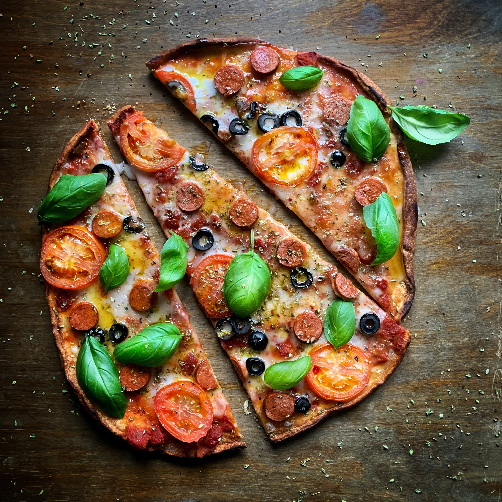

# Menu

## Pizze klasyczne

|Lp.| Pizza:                                                                          | Rozmiar:| 30cm | 50cm | 60 cm|
|---|---------------------------------------------------------------------------------|---------|------|------|------|
|1. | MARGHARITA (sos pomidorowy, ser, oregano)                                       |         | 20zł | 40zł | 50zł |
|2. | FUNGHI (sos pomidorowy, ser,pieczarki)                                          |         | 22zł | 42zł | 52zł |
|3. | SALAMI (sos pomidorowy, ser mozzarella, salami)                                 |         | 23zł | 43zł | 53zł | 
|4. | VESUVIO (sos pomidorowy, podwójny ser, szynka)                                  |         | 24zł | 44zł | 54zł |
|5. | MILANO (sos pomidorowy, ser, szynka, papryka i oregano)                         |         | 26zł | 45zł | 55zł |
|6. | KEBAB (sos pomidorowy, ser, kebab, sos czosnkowy)                               |         | 26zł | 46zł | 56zł |
|7. | QUATTRO FROMAGI (sos pomidorowy, 4 sery, oregano)                               |         | 26zł | 47zł | 57zł |
|8. | GRECKA (sos pomidorowy, ser, oliwki, feta, sałata lodowa)                       |         | 26zł | 48zł | 58zł |
|9. | HAWAJSKA (sos pomidorowy, ser, szynka, ananas)                                  |         | 26zł | 49zł | 59zł |
|10.| BARBEQUE (sos pomidorowy, ser, kurczak, boczek, cebula, sos barbeque, oregano)  |         | 26zł | 50zł | 60zł |

## Pizze Wegetariańskie

|Lp.| Pizza:                                                                          | Rozmiar:| 30cm | 50cm | 60 cm|
|---|---------------------------------------------------------------------------------|---------|------|------|------|
|1. | MARGHARITA (sos pomidorowy, ser, oregano)                                       |         | 20zł | 40zł | 50zł |
|2. | FUNGHI (sos pomidorowy, ser,pieczarki)                                          |         | 22zł | 42zł | 52zł |
|3. | HAWAJSKA VEGE (sos pomidorowy, ser , ananas)                                    |         | 23zł | 43zł | 53zł | 
|4. | GRECKA (sos pomidorowy, ser, oliwki, feta, sałata lodowa)                       |         | 26zł | 48zł | 58zł |
|5. | MILANO VEGE (sos pomidorowy, ser, papryka i oregano)                            |         | 26zł | 45zł | 55zł |

## Pizza Calzone - zwinięta w pieróg

|Lp.| Pizza:                                                                          | Rozmiar:| 30cm | 50cm | 60 cm|
|---|---------------------------------------------------------------------------------|---------|------|------|------|
|1. | KEBAB (sos pomidorowy, ser, kebab, sos czosnkowy)                               |         | 26zł | 46zł | 56zł |
|2. | GRECKA (sos pomidorowy, ser, oliwki, feta, sałata lodowa)                       |         | 26zł | 48zł | 58zł |
|3. | BARBEQUE (sos pomidorowy, ser, kurczak, boczek, cebula, sos barbeque, oregano)  |         | 26zł | 50zł | 60zł |

## Makarony

|Lp.| Makaron:                                                                        | Porcja :| 500g | 650g | 
|---|---------------------------------------------------------------------------------|---------|------|------|
|1. | SPAGETTI NAPOLI (makaron z sosem pomidorowym i serem)                           |         | 30zł | 50zł |
|2. | SPAGHETTI BOLONIA (makaron z sosem bolońskim)                                   |         | 20zł | 46zł | 
|3. | SPAGHETTI CARBONARA (makaron z sosem carbonara)                                 |         | 28zł | 48zł |

## Sałatki 

1. Cesar (sałata, oliwa z oliwek, pomidor, cebula) - 15 zł
2. Grecka ( sałata, cebula, oliwa z oliwek, pomidor, oliwki, feta) - 20 zł
3. Hiszpańska ( sałata, cebula, oliwa z oliwek, pomidor, oliwki, mozarella) - 25 zł 

## Sosy

1. Czosnkowy - 5 zł
2. Pomidorowy - 5zł
3. Barbeque - 5 zł
4. Sezamowy - 5 zł
5. Majonezowy - 5 zł

## Napoje

|Lp.| Napój:                                                                          | Pojemność :| 330ml | 500ml | 
|---|---------------------------------------------------------------------------------|------------|-------|-------|
|1. | Woda                                                                            |            | 5zł   | 10zł  |
|2. | Sok pomarańczowy                                                                |            | 7zł   | 12zł  | 
|3. | Sok jabłkowy                                                                    |            | 7zł   | 12zł  |
|2. | Piwo jasne                                                                      |            | 10zł  | 15zł  | 
|3. | Piwo ciemne                                                                     |            | 12zł  | 17zł  |

